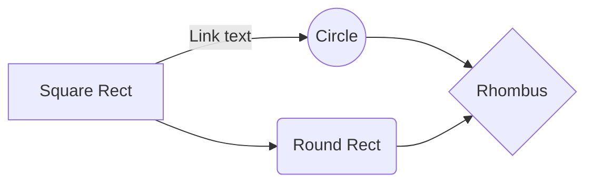

# Program to manage the calls for the lift
This program manages the calls for the lift from each floor and shows the path of the lift in order to achieve the maximum efficiency.

## Working

The program uses two working threads to manage its functioning.

The first thread is responsible for data collection and storing it according to the type of request made.

The second thread is responsible for parsing the data and managing which direction the lift should go or stop. This thread also manages to stop the lift at those floors which are in its path i.e. if the lift is supposed to go to 12th floor and someone at 8th floor requests to go up if the lift is coming from lower lever at the time the request is made, the lift will stop at 8th floor and in case the request was for going down it will do the same after completing the ongoing request. This thread also manages the output window which displays the current state of the lift.

## Video Demonstration

### Click on the images to view in a higher resolution

This is a demonstration for the code's ability to manage the floor calls on the fly. The code takes the input from the floor and manages the path of the lift so that if the lift is moving in one direction all the calls for that are first attended. By doing this the unnecessary directional changes in the path are prevented.

This is to demonstrate the ability to filter out the invalid inputs which are entered during the runtime.

This demonstrates if the directional buttons are pressed on the same floor the lift's output changes accordingly while staying at the same floor.

##  Functional Flow Chart

